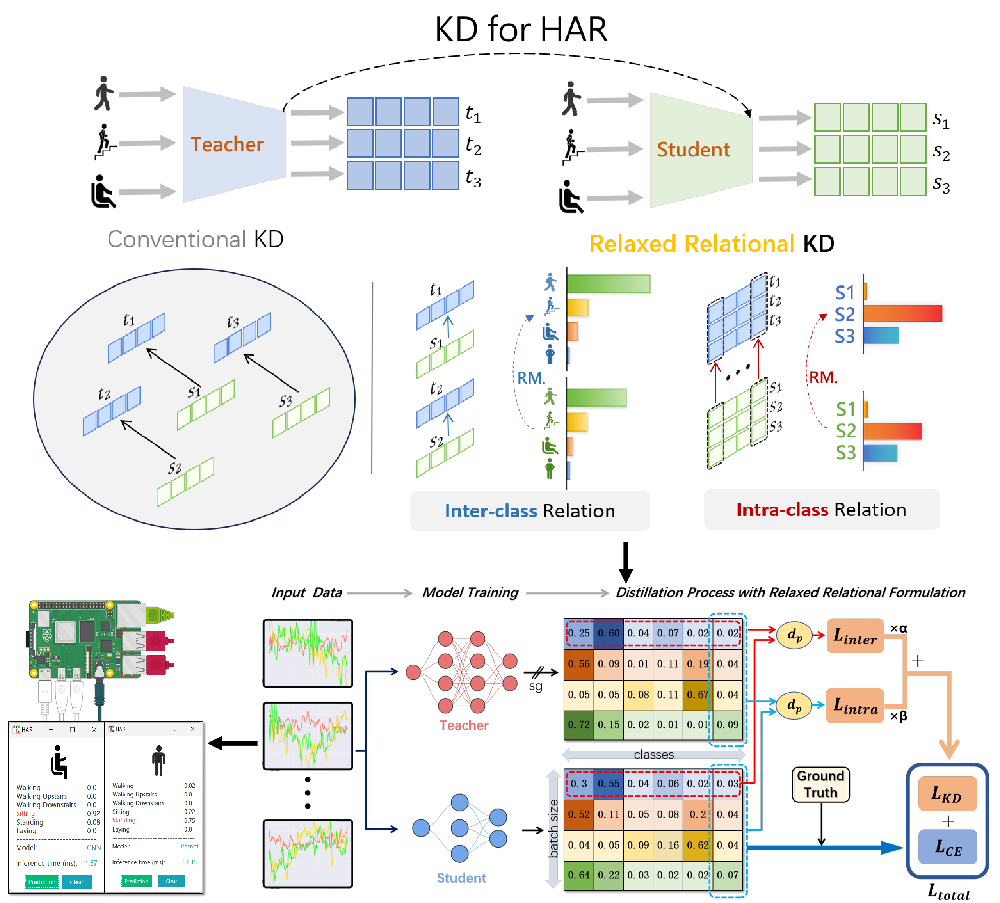

# RRKD
Human Activity Recognition (HAR) has increasingly attracted interest within the ubiquitous computing community, focusing on improving model effectiveness and precision for deployment on devices with limited processing capabilities, essential for real-time applications. However, current deep learning approaches in HAR encounter challenges such as high computational demand, overfitting due to complex model architectures, and the difficulty of transferring deep model insights to simpler, deployable models. To address these issues, this paper introduces a pioneering Relaxed Relational Knowledge Distillation approach (RRKD) that captures relational dynamics in sensor data using a robust, well-optimized, and computationally modest fully convolutional network. Extensive experiments confirm that RRKD surpasses existing state-of-the-art algorithms in achieving superior accuracy and operational efficiency without requiring extensive hardware resources, bridging a critical gap between knowledge distillation and efficient activity recognition. Visualization analysis demonstrates that RRKD effectively identifies and interprets underlying patterns and connections in time series sensor data, highlighting its potential to capture the nuances of sensor data. The implementation has been successfully evaluated on an embedded platform.

